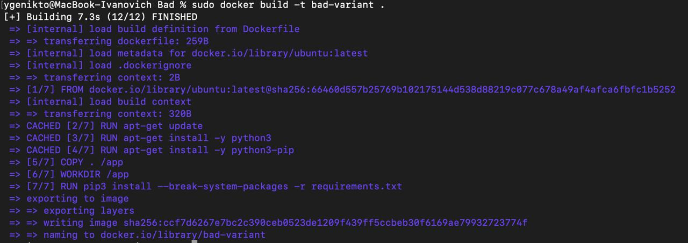
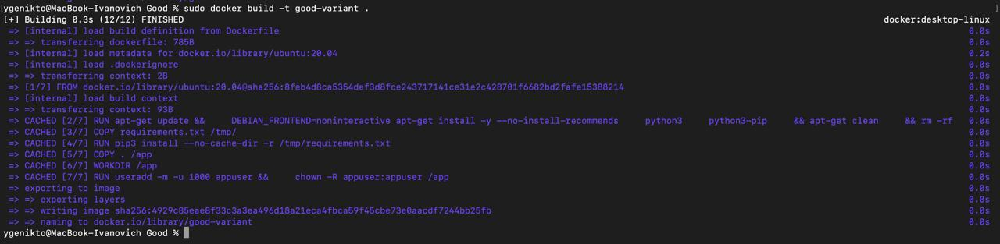
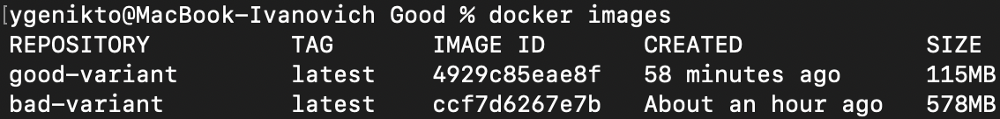

# Отчет по лабораторной работе №2
### Задание:
1) Написать “плохой” Dockerfile, в котором есть не менее трех “bad practices” по написанию докерфайлов
2) Написать “хороший” Dockerfile, в котором эти плохие практики исправлены
3) В Readme описать каждую из плохих практик в плохом докерфайле, почему она плохая и как в хорошем она была исправлена, как исправление повлияло на результат
4) В Readme описать 2 плохих практики по работе с контейнерами. ! Не по написанию докерфайлов, а о том, как даже используя хороший докерфайл можно накосячить именно в работе с контейнерами.

------

## Ход работы
Для начала мы стали смотреть и изучать базу написания Dockerfil'ов, определили базовые паттерны написания, что и как происходит, базовый синтаксис.

После мы приступили к написанию плохого варианта. 

``` 
FROM ubuntu:latest

RUN apt-get update
RUN apt-get install -y python3
RUN apt-get install -y python3-pip

COPY . /app

WORKDIR /app

RUN pip3 install --break-system-packages -r requirements.txt

CMD ["python3", "app.py"] 
``` 

Затем исправили и написали хороший вариант
``` 
FROM ubuntu:20.04

RUN apt-get update && \
    DEBIAN_FRONTEND=noninteractive apt-get install -y --no-install-recommends \
    python3 \
    python3-pip \
    && apt-get clean \
    && rm -rf /var/lib/apt/lists/*

COPY requirements.txt /tmp/
RUN pip3 install --no-cache-dir -r /tmp/requirements.txt

COPY . /app
WORKDIR /app

CMD ["python3", "app.py"]
```

1) Использование тега ` latest ` <br>
Вместо этого лучше использовать конкретную версию `FROM ubuntu:20.04`, тк этот тег использует последнюю версию, а сборки в разное время могут давать разные результаты. Так же так мы избежим поломок зависимостей
2) Множественные инструкции `RUN`
- Каждая команда RUN создает отдельный слой, это ведет к увеличению размера образа, а значит и к потере времени.
- В каждом слое сохраняются временные файлы.<br>
- Перепишем через одну инструкцию: 
```
RUN apt-get update && \
    DEBIAN_FRONTEND=noninteractive apt-get install -y --no-install-recommends \
    python3 \
    python3-pip \
    && apt-get clean \
    && rm -rf /var/lib/apt/lists/*
```
  Таким образом мы уменьшаем время, память и делаем эффективнее кэширование при пересборке<br>

3) Копирование кода до установки зависимостей

```
COPY . /app
RUN pip3 install -r requirements.txt
```
- При любом изменении любого файла сбрасывается кэш для установки зависимостей
- Очень медленная разработка и тестирование <br>
Переписав порядок: 
```
COPY requirements.txt /tmp/
RUN pip3 install --no-cache-dir -r /tmp/requirements.txt
COPY . /app
```
То есть сначала мы копируем версии и требования, потом устанавливаем пакеты и копируем весь проект. Это хорошо так как:
- Быстрая пересборка при изменении кода приложения
- Эффективное использование кэша
- Ускорение разработки 

## Сравнение
При сборке видна разница:<br>
Фото 1: сборка плохого докерфайла <br>


Фото 2: сборка хорошего докерфайла <br>


- Время сборки:<br>
Плохой: 7.3 с<br>
Хороший: 0.3 с

Фото 3:<br>
 
- Память:<br>
Плохой: 578 МБ<br>
Хороший: 115 МБ

### Плохие практики по работе с контейнерами
1) Хранение данных в контейнере<br>
Неправильно, тк данные сохраняются прямо в контейнере:
```
docker run --name database postgres
```
Эта практика приводит к потере данных при перезапуске или обновлении версии. Поэтому данные лучше хранить в томах, при использовании Volumes данные сохраняются туда и новый контейнер сможет к ним подключится.
```
docker volume create db_data
docker run --name my-db -v db_data:/var/lib/postgresql/data postgres
```
Первой строкой мы создаем том, а второй запускаем контейнер.

2) Один контейнер - один процесс <br>
` docker run my-app` - неверно<br>
 То есть не надо в один контейнер пихать и БД, и Фронт, и бэк. Из-за этого все логи смешиваются и если падает одна часть, то падает и все остальные. 
Еще вследствии этого тяжело выявить где ошибки.<br>
Решением является использование отдельного контейнера для каждой части: 
```
# БД
docker run --name db postgres

# Бэк  
docker run --name backend node-app

# Фронт
docker run --name frontend nginx
```