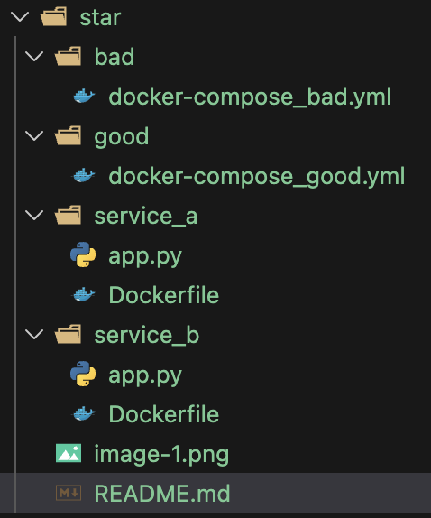
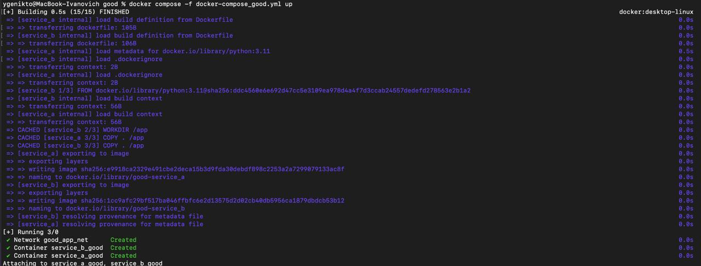
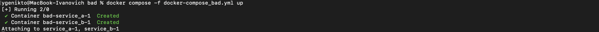

# Отчет по лабораторной работе №2 со звездочкой
### Задание:
1) Написать “плохой” Docker compose файл, в котором есть не менее трех “bad practices” по их написанию
2) Написать “хороший” Docker compose файл, в котором эти плохие практики исправлены
3) В Readme описать каждую из плохих практик в плохом файле, почему она плохая и как в хорошем она была исправлена, как исправление повлияло на результат
4) После предыдущих пунктов в хорошем файле настроить сервисы так, чтобы контейнеры в рамках этого compose-проекта так же поднимались вместе, но не "видели" друг друга по сети. В отчете описать, как этого добились и кратко объяснить принцип такой изоляции


------

## Ход работы
Начнем сначала. Мы задались вопросом: что вообще такое этот ваш compose? 
Нашли ответ -- это такая штука/инструмент, которая дает возможность одновременно, через один файлик запустить несколько контейнеров и управлять ими между собой.

Потом посмотрели пару видосов по теме и пару статеек почитали. Далее мы приступили к написанию плохого варианта. 

Создал другую папку и сделал там в целом то же самое, что и в обычной лабе, такая структура получилась:


[Плохой вариант](bad/docker-compose_bad.yml)
``` 
services:
  service_a:
    build: ../service_a
    image: service_a:latest
    network_mode: host
    environment:
      SECRET_KEY: "hardcoded-secret"
    ports:
      - "8000:8000"

  service_b:
    build: ../service_b
    image: service_b:latest
    network_mode: host
    environment:
      SECRET_KEY: "another-secret"
    ports:
      - "8001:8001"
    depends_on:
      - service_a
``` 
Запустили и ура, все работает, а значит едем дальше.



Затем исправили и написали [хороший вариант](good/docker-compose_good.yml)
``` 
version: "3.9"

services:
  service_a:
    build: ../service_a
    container_name: service_a_isolated
    ports:
      - "127.0.0.1:8000:8000"
    env_file:
      - service_a.env
    networks:
      - net_a

  service_b:
    build: ../service_b
    container_name: service_b_isolated
    ports:
      - "127.0.0.1:8001:8001"
    env_file:
      - service_b.env
    networks:
      - net_b

networks:
  net_a:
    driver: bridge
  net_b:
    driver: bridge

```

И оно тоже запустилось.

## Плохие практики
1) #### ` network_mode: host `

Используется сеть хоста для обоих сервисов.<br>
<b> Почему плохо:</b>контейнеры не изолированы в сети, они используют порты хоста напрямую. Могут конфликтовать порты, нельзя запустить два одинаковых проекта.<br><br>
<b> Решение:</b> сделать обычные docker‑сети. Контейнеры получает свои внутренние айпишники и изолируются. Собственно так и реализована изоляция контейнеров из ТЗ в пункте 4. ОНи поднимаются вместе, но у каждого контейнера своя сеть.
```
networks:
  net_a:
    driver: bridge
  net_b:
    driver: bridge
```


2) #### Порты `8000:8000` и `8001:8001`
<b> Почему плохо:</b> таким образом порт открывается на всех интерфейсах, следовательно контейнер виден из локальной сети. Для разработки это лишний риск.<br><br>
<b> Решение:</b> `127.0.0.1:8000:8000` и - `127.0.0.1:8001:8001`.
Теперь сервисы доступны только с компа разработчика и не выходят в локальную сеть. Это дает бОльшую безопасность.

3) #### Использование `latest` для образов

`image: service_a: latest`<br>
`image: service_b: latest`<br>
<b> Почему плохо:</b> данный тег не гарантирует фиксированную версию образа. При пересборке или переносе на другое устройство можно получить другую версию. При новом запуске проект может начать вести себя по-другому, это может запутать вас, или другого разработчика  <br><br>
<b> Решение:</b> в хорошем варианте теги либо вообще не указываются, те образы используются только как локальные, собранные через build. Или фиксируются на конкретной версии базового образа в Dockerfile `python:3.11`. Это даёт стабильное, предсказуемое окружение.

Еще могу отметить что запустилось достаточно быстрее хороший вариант. Объяснить особо не могу почему так, но я это заметил)

